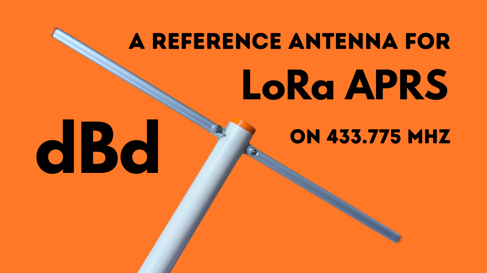

# A reference antenna for LoRa APRS on 433.775 MHz

As my list of planned antennas to build for LoRa APRS on 433.775 MHz keeps growing, I started thinking about a simple and sufficiently accurate way for a home builder to characterize and compare the antennas I build. Being an amateur, I clearly don't have access to an anechoic chamber and 6 digit measuring equipment. But for a simple metric such as "gain" (directivity), comparing any antenna to a 1/2 λ dipole is a fairly standard practice. And a 1/2 λ dipole is also one of the simpler antennas you can build, and quite hard to mess up. So before embarking on more exotic builds, such as the Moxon or the HB9CV for 70 cm, I figured I make one of these as a reference to gauge how close I come to the theoretical gain or directivity of future builds. The build is both simple and inexpensive, and requires no hard-to-obtain parts nor tools. So; if you too like to experiment with antennas for LoRa APRS or other services in the 70 cm ham radio band or the 433 MHz LSM band, you too can build such a reference antenna to take some of the guesswork out of judging the qualities of your builds!

Good luck! And if you do build it, I always enjoy seeing pictures of the result!

The bill of material below is for my build.

## Bill of Materials:

- 2 x 8 mm diameter aluminium pipe, 180 mm long
- 1 x 5 mm fiber glass rod, 100 mm long
- 1 x 20 mm PVC pipe
- 1 x RG-58 Coax, 60 cm
- 1 x Panel/chassis SMA connector for RG-58
- 2 x M2 bolts, 12 mm
- 4 x M2 washer
- 2 x M2 Lock nut
- 2 component adhesive (epoxy) and 3D-printed parts.

## 3D Printed Parts

All the 3D-printed parts are parametric, so using FreeCAD you could easily adopt the design to different size components. Design is licensed under the GNU General Public License V3.0! 

- [LoRa-Reference-Dipole-Parts.fcstd](<LoRa-Reference-Dipole-Parts.fcstd>)

### Front Cap

[LoRa-Reference-Dipole-Parts-Front Cap.stl](<LoRa-Reference-Dipole-Parts-Front-Cap.stl>)

### End Cap option for SMA connector

[LoRa-Reference-Dipole-Parts-End-Cap-SMA.stl](<LoRa-Reference-Dipole-Parts-End-Cap-SMA.stl>)

### End Cap option for BNC connector

[LoRa-Reference-Dipole-Parts-End-Cap-BNC.stl](<LoRa-Reference-Dipole-Parts-End-Cap-BNC.stl>)

### Choke Support

[LoRa-Reference-Dipole-Parts-Choke-Support.stl](<LoRa-Reference-Dipole-Parts-Choke-Support.stl>)

### Element End Plug

[LoRa-Reference-Dipole-Parts-Element-Plug.stl](<LoRa-Reference-Dipole-Parts-Element-Plug.stl>)

### Drill Guide

[LoRa-Reference-Dipole-Parts-Drill-Guide.stl](<LoRa-Reference-Dipole-Parts-Drill-Guide.stl>)

-- 
Med vennlig hilsen / regards, 
Bård Bjerke Johannessen <bbj@bbj.io> 

There is no cloud. It's just someone else's computer!